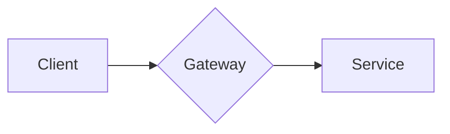

# Blog content

Drop a Markdown file in this folder and it becomes a post at `/blog/<filename>`
(the file name, without `.md`, is the slug). Posts are rendered to HTML at build
time by `tools/build-blog.ts` — there is no runtime Markdown parsing.

## Frontmatter

Every post starts with a YAML frontmatter block:

```yaml
---
title: 'How I design idempotent payment APIs' # required
description: 'A practical guide to exactly-once payment semantics.' # required — used for SEO meta + card excerpt
date: 2026-05-20 # required — publish date (YYYY-MM-DD)
updated: 2026-06-01 # optional — last-updated date
tags: [Payments, Distributed Systems, APIs] # optional
cover: /blog/idempotent-payments/cover.png # optional — put the image in apps/web/public/blog/<slug>/
keywords: 'idempotency key, payment api, exactly once' # optional — extra SEO keywords
author: 'Outhan Chazima' # optional — defaults to the site author
draft: false # optional — true hides the post from build output
---
```

## Authoring

- Use normal Markdown: headings, lists, tables, blockquotes, images, links.
- Fenced code blocks are syntax-highlighted (Shiki, dual light/dark theme).
- `##` and `###` headings automatically get anchor links and feed the
  table of contents.

### Images

Standard Markdown — works with both uploaded files and remote URLs. Images are
lazy-loaded automatically.

```markdown
 <!-- uploaded: apps/web/public/blog/my-post/ -->
 <!-- remote URL -->
```

Put uploaded images under `apps/web/public/blog/<slug>/` and reference them with
an absolute path (`/blog/<slug>/file.png`). The `cover:` frontmatter field uses
the same paths.

### Mermaid diagrams

Use a fenced code block with the `mermaid` language. It renders to an SVG in the
browser, themed to match light/dark mode:

````markdown

````

The raw definition stays in the HTML, so it's crawlable and visible without JS.

On `bun run build` / `bun run start`, the prebuild step regenerates the post data,
the sitemap and the RSS feed automatically.
